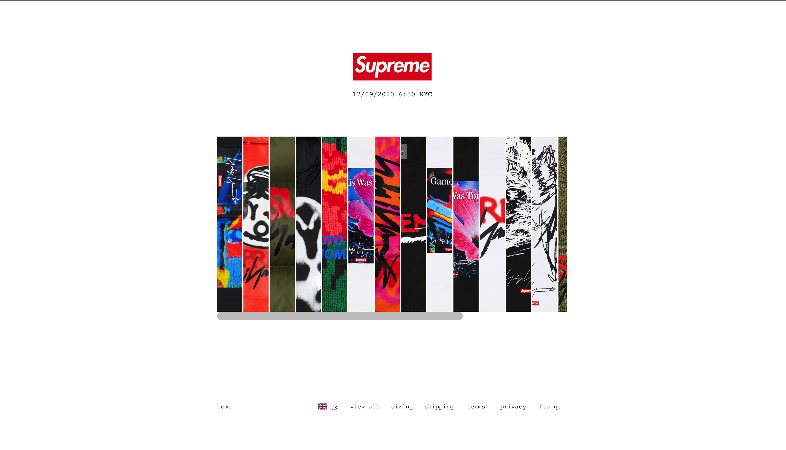
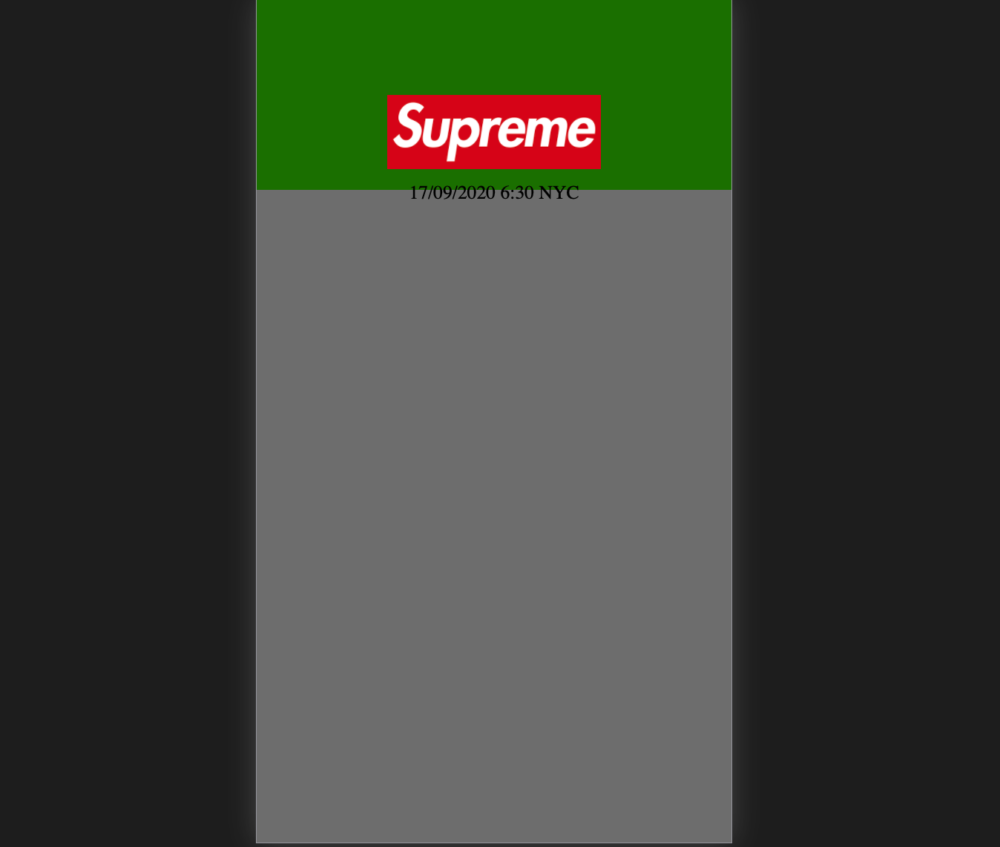

# Procesverslag
**Auteur:** -Rikkert Honing-

Markdown cheat cheet: [Hulp bij het schrijven van Markdown](https://github.com/adam-p/markdown-here/wiki/Markdown-Cheatsheet). Nb. de standaardstructuur en de spartaanse opmaak zijn helemaal prima. Het gaat om de inhoud van je procesverslag. Besteedt de tijd voor pracht en praal aan je website.

## Bronnenlijst
1. -w3schools.com-
2. -css-tricks.com-
3. -Codepen.io-

## Eindgesprek (week 7/8)

-dit ging goed & dit was lastig-

**Screenshot(s) Eindproduct:**

## Voortgang 3 (week 6)

### Stand van zaken

Ik ben bezig geweest met het toevoegen van een aantal css elementen om de pagina wat meer aan te kleden. Ik heb een dropdown menu gemaakt in de footer om taal te selecteren en heb bijbehorende hover elementen toegevoegd. Ook heb ik geprobeerd om de article op het home menu bij het inladen van de pagina zelf te laten scrollen naar links, maar dit is me na uren lang prutten niet gelukt. Mijn eerste pagina was al responsive, dus kon ik verder focussen op het maken van mijn tweede pagina. Deze ben ik begonnen om alles onder elkaar te plaatsen zoals de originele website ook heeft, totdat ik laatst doorwerkte en zag dat ze hun website hebben aangepast bij klein formaat. Ook ik heb dus deze aanpassingen toegevoegd om de responsiveness op een manier te krijgen die ik nog nooit gebruikt heb. Ik heb doormiddel van Javascript een werkende collage gemaakt op de productpagina waar de gebruiker verschillende voorbeelden kan zien. Als laatste touches heb ik gecontroleerd of alles werkte en compleet was voor de eindoplevering.

**Screenshot(s):**

### Agenda voor meeting

| Mirna                      | Rikkert                   | Bas                          | Sophie                                           |
| -------------              |:-------------:            | -----:                       | -----:                                           |
| sematisch checken CSS en HTML| Grid grootte            |   sematisch checken HTML     | Is display:none; correcte code?                  |
|                            |Grid juist plaatsen         |                              | Errors uit javascript halen                      |
|                            | img grootte in grid        |                              | Hoe krijg je gradient over een element?          |
|                            |                           |                              | Hoe zorg ik ervoor dat ie bovenaan blijft staan als hij uitklapt? VANAF REGEL 129 JS/ 125 HTML|

### Verslag van meeting

We zijn het lijstje van links naar rechts af gegaan. Dus begonnen bij feedback voor Mirna en geindigd bij Sophie. Bij mirna hebben we naar de HTML en CSS gekeken ofdat dit wel semantisch correct was. Dit was het geval. Voor de CSS is er aangegeven dat er op een container een display flex kan worden gezet i.p.v. de children elementen een diplay absolute te geven. Hierna had Rikkerteen vraag over grid. Hij had een afbeelding en een stuk tekst naast elkaar staan en dit in 2 kolommen staan en als het scherm kleiner wordt dan moesten deze onder elkaar komen. Dit kon worden opgelost door de grid columns op 1 volledige koloms breedte te zetten. Hierna kwam ik aan de beurt. Ik had de vraag of mijn HTML wel sematisch correct zou zijn. Dit was niet helemaal het geval. Ik had te veel divjes gebruikt en te veel sections. De sections konden worden vervangen voor articles. Als laatste kwam Sophie en zij had een aantal vragen. De vraag over de errors in haar JavaScript dat was te verwaarlozen. Hierna was er een vraag over hoe zij een gradient zou kunnen toevoegen over een element heen. Dit zou kunnen worden opgelost door middel van een after neer te zetten op de section. Hierna hebben we nog het vak FED geevalueerd met de student assistenten en gepraat over het volgende blok.

## Voortgang 2 (week 5)

### Stand van zaken

Ik heb afgelopen weken meer gewerkt aan mijn website en ben hierbij een aantal keer vastgelopen. Zo heb ik moeite gehad met het maken van een customizable scrollbar en het maken van het kleding keuze menu. Ik heb eerst het menu moeten maken en heb dit geprobeerd met grid, maar dit was in mijn geval niet de beste keuze. Zo kwam ik met flexbox bijna direct bij het resultaat wat ik wilde. Hierna heb ik meteen geprobeerd om deze pagina responsive te maken en na lang proberen heb ik dit gedaan met een "transform: translate" element. Vervolgens heb ik gezorgd dat het menu ook meegaat met het kleiner worden van de pagina. Na het toevoegen en bewerken van de scrollbar kon ik werken aan de footer. Deze heb ik zo gemaakt dat de pagina met een mediaquerry naar een kleine modus gaat vanaf 700px.

**Screenshot(s):**

### Agenda voor meeting

| Mirna                      | Rikkert                   | Bas                          | Sophie |
| -------------              |:-------------:            | -----:                       | -----:                                 |
|  correcte code checken     | flex-box dingetje         |  Is de tweede pagina genoeg? | Wanneer wel/niet div'jes  |
|  flex-box dingetje         | Tweede pagina meer info |                              | moeten de img op knopjes met background-image|
| Hoe krijgen we pluspunten? |                           |                              | Hoever moet filters toegepast worden? |

### Verslag van meeting

We zijn begonnen met naar de code te kijken van Mirna. Hier hebben we de CSS code opgeschoont samen met het team en met Sanne. Hij was erg tevreden over dat Mirna de selector "nth-of-type" vaak had gebruikt. Hierna zijn we verder gegaan met Rikkert om naar zijn Supreme website te kijken. Hier hebben we de carroussel op de homepage veranderd. Deze moet namelijk op het einde beginnen en op de page load naar links scrollen. 
Sanne gaf als tip om bij de CSS iets uit te commenten als je gaat testen.
Als 3e kwam Sophie aan het woord. Hier hebben we besproken of we nou wel of geen divjes mogen gebruiken. Tevens hebben we naar haar code gekeken en deze een beetje aangepast. We hebben naar de horizontale scrollable section gekeken en van divjes hebben we een ul en li gemaakt. Sanne heeft verteld dat je een aria-label aan een button moet toevoegen voor screen readers.
Als laatste heeft Bas zijn website laten zien. Hij vroeg zich af of zijn 2e pagina goed genoeg was. Dit was niet het geval en mag een meer complexere pagina kiezen om dit uit te werken. Sanne heeft gevraagd of de website ook goed werkte met alleen een keyboard en liet Bas d.m.v. de tab toets navigeren door zijn website heen.

## Voortgang 1 (week 3)

### Stand van zaken

Ik heb deze week veel moeite gehad met het werken aan de website. Dit was vooral mentaal en niet persé door het werk zelf. Het voorbereiden van de lessen verging een stuk beter dan voorheen en ik was reeds voorbereid in de les. Dit gaf een erg prettig gevoel en motivatie om door te werken aan het vak. Deze afgelopen dagen is dit mede door drukte snel afgelopen geweest. Nu ik een klein begin heb gemaakt, begint de motivatie gelukkig wel weer terug te komen en heb ik wel weer vertrouwen en zin gekregen om het werk weer op te pakken.

**Screenshot(s):**

### Agenda voor meeting

1. Semantische correctheid          (15 min)      (uitleg)
2. Javascript                       (30 min)      (opdrachten bekijken)
3. CSS uitlijningen                 (15 min)      (uitleg)

### Verslag van meeting

Samen met de student assistenten hebben we gekeken naar onze code en of deze sematisch correct was. Zei hebben ons geholpen en uitleg gegeven over media queries.

Hierna hebben we de opdrachten van FED met de javascript opdrachten samen bekeken.
Hier hebben zij samen met ons de opdracht met de shoppingcart uitgelegd.
Tevens hebben zij ons een tip gegeven dat we eerst psuedo code moeten schrijven in het nederlands en deze moeten omzetten naar javascript.

Je mag wel div's gebruiken maar gebruik ze niet voor elementen waar al een HTML5 element voor is. Als je bij je eindgesprek kan uitleggen waarom je een div hebt gebruik (bijvoorbeeld om2 elementen een display flex te geven) dan is dat ook goed.

We hebben met z'n alle naar de code van 1 van de teamleden bekeken. Dit was omdat diegene ergens niet uit kwam. 1 van de student assistenten heeft toen laten zien hoe je d.m.v. met firefox kan debuggen. Dit doe je namelijk door de css als het ware "uit te vinken" in de editor.

tip: voeg leuke of grappige animaties toe met css (als je je avontuurlijk voelt ook JavaScript) om de docenten te verrassen.

## Intake (week 1)

**Je startniveau:** -Rode Piste-

**Je focus:** -Responsiveness-

**Je opdracht:** -https://www.supremenewyork.com/index-

**Screenshot(s):**

**Breakdown-schets(en):**

